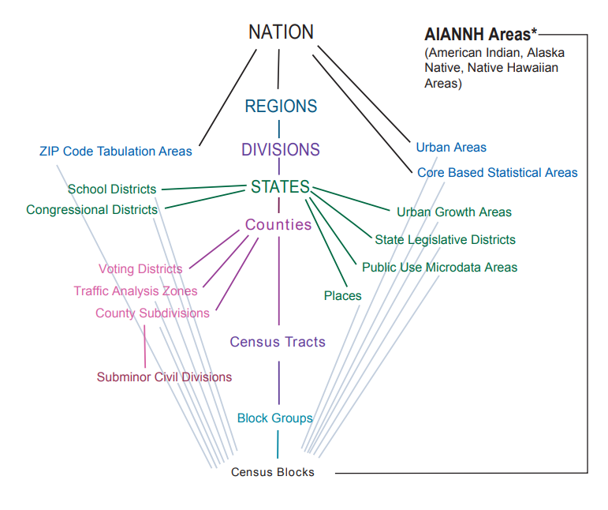

---
title: "Downloading Census Geometries with Tigris"
author: "<a href='https://ucanr.edu/?facultyid=32909' target='_blank'>Andy Lyons</a>"
date: "March 2023"
output:
  html_document: 
    mathjax: null
    self_contained: no
    lib_dir: lib
    includes:
      in_header: gtag_technotes.js
      before_body: tech_note_header.html
      after_body: tech_note_footer.html
---   

```{css echo = FALSE}
h1.title {font-weight:bold;}
h1 {font-size:30px; font-weight:bold;}
h2 {font-size:24px; font-weight:bold;}
h3 {font-size:18px; font-weight:bold;}
h4.date,h4.author {font-size:100%;}
div.protip {padding:0.5em; background-color:#ddd; border:2px solid gray; margin:0 3em;}
```
```{r setup, include = FALSE}
library(tigris)
library(dplyr)
library(sf)
library(leaflet)
```


<p style="font-style:italic; font-size:90%; margin:2em;">IGIS <a href="http://igis.ucanr.edu/Tech_Notes/">Tech Notes</a> describe workflows and techniques for using geospatial science and technologies in research and extension. They are works in progress, and we welcome feedback and comments.</p>

## Background

Most people know the US Census Bureau tabulates their data by Census Blocks, which are then aggregated into Block Groups and Tracks, as their primary enumeration areas. Not as many people know the Census Bureau also maintains GIS data for many other administrative boundaries, which they use to produce thousands of different data summaries. This collection of authoritative administrative spatial data can be downloaded for free, and is a tremendous resource you can use in *any* GIS project!

{style="display:block; margin:1em auto; width:660px;"}

In this Tech Note, we'll show you how to download administrative boundaries via the [`tigris`](https://cran.r-project.org/web/packages/tigris/index.html) R package by Kyle Walker. `tigris` has a number of convenience functions to import different census geographies into R via the Census API (you don't need an API key to download the spatial data). The functions you can use include:

<div style="float:left; width:200px; font-family:monospace; margin-left:2em;">
blocks()  
block_groups()  
tracts()  
counties()  
states()  
regions()  
places()  
pumas()  
school_districts()  
zctas()  
urban_areas()  
</div>

<div style="font-family:monospace;">
metro_divisions()  
county_subdivisions()  
congressional_districts()  
state_legislative_districts()  
voting_districts()  
native_areas()  
landmarks()  
military()  
primary_roads()  
primary_secondary_roads()  
roads()  
rails()  
</div>

<div style="clear:both;"></div>

\

All of these functions bring the spatial data into R as [`sf`](https://r-spatial.github.io/sf/) objects by default. (If you want tp keep the Shapefiles as well, you can set the `keep_zipped_shapefile` argument to `TRUE`.) For full details, view the function help pages.

\

::: {.protip}
**Pro Tip**: If you want to download not just the spatial data but also data from the decennial census or American Community Survey, see the [tidycensus](https://walker-data.com/census-r/index.html) package.
:::

\

## Example: Import Incorporated California Cities and Towns

In this example, we'll import the the boundaries of incorporated cities and towns in California using `tigris`.

### 1\. Load packages:

Step 1 is to load the packages we'll need:

```{r}
library(tigris)
library(dplyr)
library(sf)
library(leaflet)
```

\

Set Tigris cache option:

```{r}
options(tigris_use_cache = TRUE)
```

\

### 2\. Get the Places Dataset

Incorporated cities and towns are part of the [Places](https://www2.census.gov/geo/pdfs/reference/GARM/Ch9GARM.pdf) dataset, which we can download via `places()`.

```{r}
ca_places_sf <- places(state = "CA", cb = FALSE, progress_bar = FALSE) |> st_transform(4326)
dim(ca_places_sf)
head(ca_places_sf)
```

\

Reading the docs, we see that the Places dataset contains all sorts of stuff. But we can use the `LSAD` column  (Legal/Statistical Area Description) to pull out just the incorporated cities and towns. Let see what it contains:

```{r}
ca_places_sf$LSAD |> table()
```

\

Looking up the [LSAD codes](https://www.census.gov/library/reference/code-lists/legal-status-codes.html), we find:

:::{style="margin-left:2em;"}
25\. City (suffix). Consolidated City, County or Equivalent Feature, County Subdivision, Economic Census Place, Incorporated Place

43\. Town (suffix). County Subdivision, Economic Census Place, Incorporated Place

57\. CDP (suffix). Census Designated Place, Economic Census Place (**not** incorporated)
:::

\

Therefore, we want the Places where the LSAD is 25 (cities) or 43 (towns):

```{r}
ca_cities_towns_sf <- ca_places_sf |> 
  filter(LSAD %in% c(25, 43))

dim(ca_cities_towns_sf)
```

\

### 3\. Plot the Data to Cross-Check

Plotting is a good way to reality-check the data. First we download the state boundary:

```{r}
cabnd_sf <- states(cb = TRUE) |> filter(GEOID == "06") |> st_transform(4326)
```

\

Next, we make a version of the cities & towns layer that includes a column of color values:

```{r}
random_cols <- c("#89C5DA", "#DA5724", "#74D944", "#CE50CA", "#3F4921", "#C0717C", "#CBD588", "#5F7FC7", "#673770", "#D3D93E", "#38333E", "#508578", "#D7C1B1", "#689030", "#AD6F3B", "#CD9BCD", "#D14285", "#6DDE88", "#652926", "#7FDCC0", "#C84248", "#8569D5", "#5E738F", "#D1A33D", "#8A7C64", "#599861")

ca_cities_towns_4map_sf <- ca_cities_towns_sf |> 
  mutate(col = sample(random_cols, nrow(ca_cities_towns_sf), replace = TRUE)) |> 
  select(NAMELSAD, col)
```

\

Now we can make the plot in leaflet:

```{r leaflet_map, cache = FALSE}
leaflet(cabnd_sf) |> 
  addProviderTiles("CartoDB.Positron") |> 
  addPolygons(fill = FALSE, color = "black", weight = 5) |> 
  addPolygons(data = ca_cities_towns_4map_sf, color = "#777", weight = 1,
              fill = TRUE, fillColor = ~col, popup = ~NAMELSAD)
```

Looks good!

\

### 4\. Export as CSV and GeoJSON

The layers we've imported are standard simple feature data frames, so we can export them to disk using `write.csv()` for just the attribute table, or `st_write()` to save the data in various GIS file formats.

\

Save the attribute table as a CSV file:

```{r}
ca_cities_towns_sf |> 
  select(GEOID, NAME, LSAD, LAND_AREA_M2 = ALAND, WATER_AREA_M2 = AWATER) |> 
  st_drop_geometry() |> 
  write.csv(file = "./outputs/ca_cities_towns_2021.csv", row.names = FALSE)
```

You can preview and download the CSV file [here](https://github.com/UCANR-IGIS/tech_notes/blob/main/docs/outputs/ca_cities_towns_2021.csv).

\

Save the spatial data with a handful of columns as GeoJSON:

```{r}
ca_cities_towns_sf |> 
  select(GEOID, NAME, LSAD, LAND_AREA_M2 = ALAND, WATER_AREA_M2 = AWATER) |> 
  st_write(dsn = "./outputs/ca_cities_towns_2021.geojson", delete_dsn = TRUE)
```

You can preview and download the GeoJSON file [here](https://github.com/UCANR-IGIS/tech_notes/blob/main/docs/outputs/ca_cities_towns_2021.geojson).

\

## Summary

The US Census Bureau is a great source of up-to-date spatial data for many types of administrative boundaries for the USA. You can import these data into R fairly easily with the `tigris` package, and then use functions from `dplyr` and `sf` to wrangle the data and export them as GIS files. This is a great resource for any GIS project.

\

