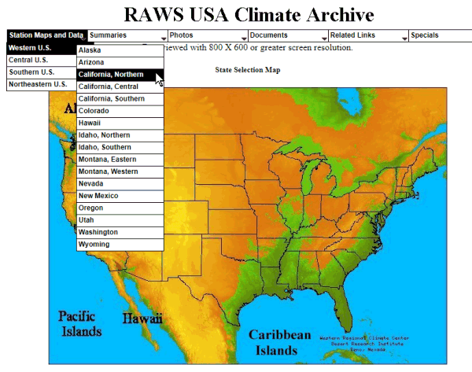
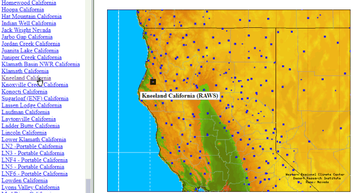
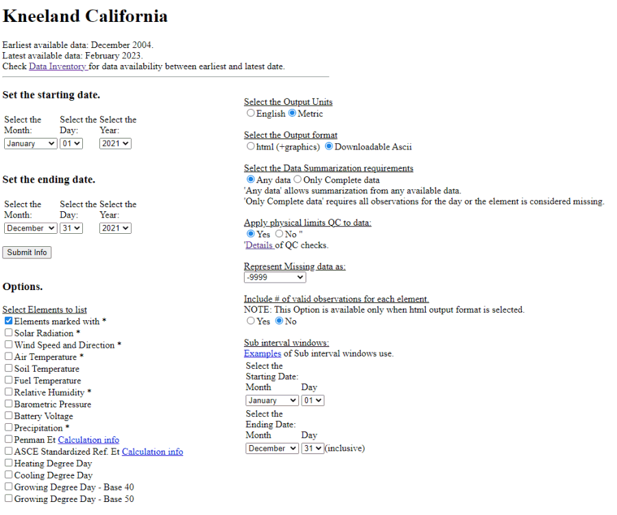
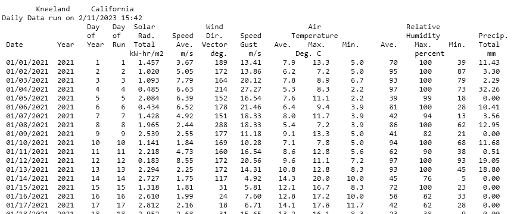

```{css echo = FALSE}
h1.title {font-weight:bold;}
h1 {font-size:30px; font-weight:bold;}
h2 {font-size:24px; font-weight:bold;}
h3 {font-size:18px; font-weight:bold;}
h4.date,h4.author {font-size:100%;}
```

<p style="font-style:italic; font-size:90%; margin:2em;">IGIS <a href="http://igis.ucanr.edu/Tech_Notes/">Tech Notes</a> describe workflows and techniques for using geospatial science and technologies in research and extension. They are works in progress, and we welcome feedback and comments.</p>

## Background

The Remote Automatic Weather Stations ([RAWS](https://raws.nifc.gov/){target="_blank" rel="noopener"}) network consists of nearly 2,200 weather stations located strategically throughout the United States. Maintained through a partnership of several agencies, the stations provide weather data for a variety of projects including rating fire danger and monitoring air quality.

RAWS units collect, store, and forward data to a computer system at the National Interagency Fire Center (NIFC) in Boise, Idaho. There is no known public API for accessing the data[^1]^,^[^2], so importing the data involves going to a website such as [Western Regional Climate Center](https://raws.dri.edu/){target="_blank" rel="noopener"} or [WXx Weather Stations](https://weather.nifc.gov/ords/prd/f?p=107:11500:10535513756590:::::){target="_blank" rel="noopener"}, entering the parameters for your request in a webform (e.g., station, date range, variables), generating the results, either as a table or CSV file.

[^1]: You can try [RAWSmet](https://mazamascience.github.io/RAWSmet/), which is a R package developed by Jonathan Callahan which is designed to import RAWS data into R by downloading and parsing files from the Climate, Ecosystem and Fire Applications (CEFA) program at the Desert Research Institute. In our testing, this worked but we were only able to download data through 2017 for our station of interest. Hence we went back to manually downloading data from the website.

[^2]: RAWS data is available through the [MesoNet API](https://synopticdata.com/mesonet-api){target="_blank" rel="noopener"} from Synoptic.


\

## Importing RAWS Data from the Western Regional Climate Center

The rest of this Tech Note will demonstrate how to import RAWS data downloaded from the [Western Regional Climate Center](https://raws.dri.edu/){target="_blank" rel="noopener"}. This is not a modern data portal however and the download process can not be automated[^3].

[^3]: Actually querying data from the web form could probably be automated with web-scraping methods in combination with a virtual browser using a package like RSelenium. It would be a lot of work though, and only worth the effort if you needed to query a lot of data.

The first step is to find your station of interest. Go to [Western Regional Climate Center](https://raws.dri.edu/){target="_blank" rel="noopener"} and select the region of interest:

{style="display:block; margin:1em auto; border:1px solid grey;"}

\

Next, select a station from list and click on its name to go to the data page for that station:

{style="display:block; margin:1em auto; border:1px solid grey;"}
\

For example to get to the data download page for Kneeland, CA, click [here](https://raws.dri.edu/cgi-bin/rawMAIN.pl?caCKNE){target="_blank" rel="noopener"}. To download data for a range of dates, select the '**Daily Summary Time Series**' link, enter your start and end dates, and the variables you want:

{style="display:block; margin:1em auto; border:1px solid grey;"}

\

Click 'Submit Info' and in a few seconds the data will appear as an ASCII table with fixed columns. 

{style="display:block; margin:1em auto; border:1px solid grey;"}

\

Copy-paste the table into a text editor, and save it as a new text file. You are now ready to import it into R.

\

## Import the RAWS Text File into R

The text file you copied from the web browser above is not a clean CSV, but it can still be imported into R fairly easily. The code below demonstrates how to import a table generated by the screenshot above. Specifically: 

- one year of daily summary data (in this case from the Kneeland station)  
- metric units  
- the default set of weather variables (as shown above)

You can download the file we'll be importing below [here](kland_daily-sum_2021.txt). If you download a different set of variables you'll have to make adjustments to the code below. 

\

First we load a couple of packages and find the file:

```{r}
library(readr)

## Define the file location and make sure it exists
kland_fn <- "kland_daily-sum_2021.txt"; file.exists(kland_fn)
```

\

We'll also get the total number of lines in the file (which we'll need below):

```{r}
(num_lines <- kland_fn |> readLines(warn = FALSE) |> length())
```
\

Next, we define the column names manually (because this isn't a CSV file). Of course if you selected different variables when you asked for the data, your column names will be different.

```{r}
col_names <- c("date", "year", "yday", "run_day", "solrad_total", 
               "windspeed_avg", "winddir_avg", "windgust_max", 
               "tmean", "tmax", "tmin", 
               "rh_mean", "rh_max", "rh_min", "pr")
```

\

Now we're ready to import. Note below that we're using `read_table` with arguments to skip the first 6 lines of the text file, as well as the last two lines (which are a copyright note). 

```{r}
kland_tbl <- read_table(kland_fn,
                        col_names = col_names, 
                        skip = 6,
                        n_max = num_lines - 8,
                        col_types = cols(
                          date = col_date(format = "%m/%d/%Y"),
                          year = col_integer(),
                          yday = col_integer(),
                          run_day = col_integer(),
                          solrad_total = col_double(),
                          windspeed_avg = col_double(),
                          winddir_avg = col_double(),
                          windgust_max = col_double(),
                          tmean = col_double(),
                          tmax = col_double(),
                          tmin = col_double(),
                          rh_mean = col_double(),
                          rh_max = col_double(),
                          rh_min = col_double(),
                          pr = col_double())
                )
```

\

Inspect the dimensions, head, and tail to make sure we got all the dates and the columns were given the  correct data types:

```{r}
dim(kland_tbl)
head(kland_tbl)
tail(kland_tbl)
```

\

## Assign Units

We could stop here, but if you want you can assign units for most of the columns. 

```{r}
library(dplyr)
library(units)

kland2_tbl <- kland_tbl |> 
  mutate(windspeed_avg = set_units(windspeed_avg, m/s),
         winddir_avg = set_units(winddir_avg, arc_degree),
         windgust_max = set_units(windgust_max, m/s),
         tmean = set_units(tmean, degC),
         tmax = set_units(tmax, degC),
         tmin = set_units(tmin, degC),
         rh_mean = set_units(rh_mean, percent),
         rh_max = set_units(rh_max, percent),
         rh_min = set_units(rh_min, percent),
         pr = set_units(pr, mm))
```

\

Inspect:

```{r}
head(kland2_tbl)
```

\

## Summary

The RAWS network is a good source of weather data in remote, forested areas, where there may not be many alternatives. However because it is an old system and the data backend hasn't been updated to a modern API (yet!), accessing the data requires going to a website and manually querying the data. However if you do that thoughtfully and systematically, importing the results into R can be done programmatically fairly easily with standard R packages.


