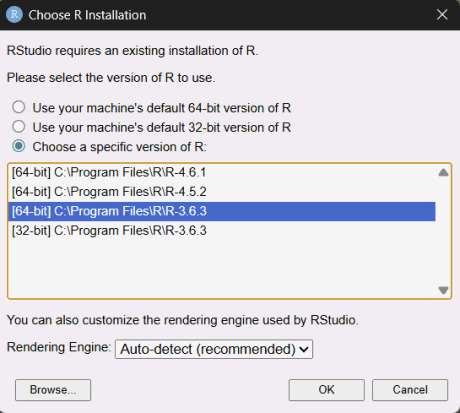
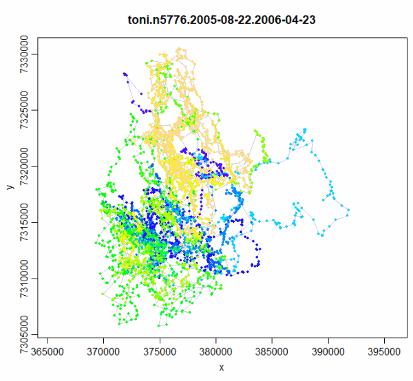

```{css echo = FALSE}
h1.title {
  font-family: Muli, "Open Sans", sans-serif;
  font-weight:600; 
  font-size:2.5rem; 
  border-top-color: rgb(237, 169, 31);
  border-top-width: 5px;
  border-top-style: solid;
  margin-top:0.5em;
  line-height:1.5;
  
}
p.subtitle {
  font-family: Muli, "Open Sans", sans-serif;
  font-size:2rem;
  font-weight:500; 
}
h2 {
  font-size:2rem;
  font-weight:500; 
  font-family:Muli,"Open Sans",sans-serif;
}
h3 {font-size:1.5rem; font-weight:500;}
h4.date,h4.author {font-size:100%;}
div.protip {padding:0.5em; background-color:#ddd; border:2px solid gray; margin:0 3em;}

div.about-technotes {
  font-style:italic; 
  font-size:90%; 
  margin:2em;
}
div.author {
  font-size:90%; 
}
img.screenshot, div.json-chunk {
  border:1px solid gray;
}
```

<hr>

:::{.about-technotes}
IGIS <a href="http://igis.ucanr.edu/Tech_Notes/">Tech Notes</a> describe workflows and techniques for using geospatial science and technologies in research and extension. They are works in progress, and we welcome feedback and comments.
:::

## Summary

[`rgdal`](https://cran.r-project.org/package=rgdal) and [`rgeos`](https://cran.r-project.org/package=rgeos) were the backbone of spatial data operations in R for over a decade. Unfortunately they eventually became out of date as their primary maintainer approached retirement, and were eventually replaced by the more modern [`sf`](https://r-spatial.github.io/sf/) package. In 2023 they were archived on CRAN and could no longer be installed through the normal channels.

Many packages that used `rgdal` and `rgeos` were updated to the `sf` package, but not all (e.g., [`tlocoh`](https://tlocoh.r-forge.r-project.org/)). This creates a challenge for current users because you can't install a package if the required dependencies are not available. This Tech Note describes a work-around to install older packages that are still dependent on `rgdal` and `rgeos`.

## Background

One of the strengths of the R ecosystem is the ability of packages to draw upon functions from other packages. This allows package developers to focus on their package's main purpose, without having to recreate everything from scratch. 

This system of dependencies however can cause problems when a dependent package becomes unavailable on CRAN. Packages can get archived on CRAN for any number of reasons, including a request from the maintainer to retire the package. Even if the package is still available from other repositories or on GitHub, the normal `install.packages()` function may no longer work. If enough time goes by, the older package may even become incompatible with the current release of R.

### Going back in time 

The very best option for packages that have broken dependencies is for the maintainer to update the package to use newer or alternative dependencies that are actively maintained. Unfortunately this is not always possible.

The next best strategy is to essentially create an **R time machine**. In other words, install an older instance of R, complete with versions of all the dependencies before they became archived, and do your work there.

Setting up an older version of R requires a few tricks, but is definitely doable. You may or may not have to install an older release of base R, but if you do they are readily available on CRAN. You won't have to uninstall your current version of R either, because R is perfectly happy having multiple versions of itself living side-by-side on your laptop. Modern IDEs like RStudio are also happy with multiple versions of R installed. You just select the version you want from the options menu, and you're transported back in time.

Similarly, older versions of R packages are available on CRAN and other repositories. There are also special packages like [`groundhog`](https://groundhogr.com/) which are designed specifically to help you find and install older packages. 

## Example: Installing `tlocoh`

[`tlocoh`](https://tlocoh.r-forge.r-project.org/) ([Lyons et al, 2013](http://www.movementecologyjournal.com/content/1/1/2)) is a brilliant package to analyze spatiotemporal patterns in animal movement. Unfortunately, the last real update to tlocoh was in 2013, and since then several of its dependent packages have been retired, including `rgdal`, `rgeos`, and `gcplib`. To make matters worse, some of the dependencies are no longer compatible with the most recent version R, meaning we'll have to install an older version of R as well.

::: {.callout-note title="Workflow Overview"}

1. Identify a date when everything was working  
1. Install an older version of base R (if needed)  
1. Install RTools (if needed, but common)  
1. Identify required dependencies  
1. Install historical versions of the dependencies  
1. Install the package you want to use  
1. Do your work
1. Save outputs to disk in standard formats so you can continue to work with them in the current version of R and other software, 
:::

### Step 1. When did it last work?

The first step is to identify a date when the package worked. For this example, we'll go back to January 1, 2020, which is well before `rgdal` and `rgeos` were archived. 

### Step 2. Install an older version of R (if needed)

::: {.callout-note title="Do I really need an older version of R?"}
You may or may not need an older version of R to use your broken package. It depends on how old the package you are trying to use is, and why it and/or its dependencies are no longer available on CRAN.

Some packages get archived on CRAN because CRAN administrators cannot contact the maintainer, or the package doesn't meet a new standard from CRAN. It may still work fine with the current release of R, provided you can find it on GitHub or some other source.

That being said, there are definitely some packages that get broken with updates to base R. If the package you are trying to revive, or one of its dependencies, falls in this category, then you need to install an older version of R.

To determine whether your package or any of its dependencies are incompatible with the current release of R, you can ask a search engine or GenAI tool which will point you to documentation and announcements.
:::

To make sure we have a compatible version of R, we'll install a release that was active when everything was working. Looking at CRAN's list of [Previous Releases of R](https://cran.r-project.org/bin/windows/base/old/), we see that that R 3.6.3 was published in February 2020. So we'll go with that. You can download older versions of R from <https://cran.r-project.org/bin/windows/base/old/>. 

### Step 3. Install RTools

RTools is a separate set of utilities to install packages that need to be compiled from source. Not many packages need compilation these days, but older packages are often only available as source. Compilation may also be required if the package uses libraries from C++ or other languages ([more info](https://groundhogr.com/help-with-r-tools-only-for-windows-users/)). In our case, we definitely need RTools because `rgdal`, `rgeos` and `gpclib` are all wrappers for functions written in C++.

::: {.callout-tip title="Do I really need RTools?"}
It isn't always obvious whether a package needs to be compiled or not. The simplest way to find out if you need RTools is simply to try to install a package. If it needs to be compiled and you don't have RTools installed, you'll be informed!
:::

The current version of RTools is 4.5, however looking at the [RTools compatibility table](https://cran.r-project.org/bin/windows/Rtools/history.html) we see that R 3.6.3 was is only compatible with  **RTools 3.5** and earlier. Hence we should download and install RTools 3.5. 

::: {.callout-tip title="Tips for installing RTools"}
1. When installing RTools, accept the default location (e.g., C:\\Rtools). If you put it somewhere else, things can break.

2. During installation, be sure to select the option to add RTools to the system PATH. 

3. After installing, you can verify that RTools is on the path and R can find it by running:

```{r eval = FALSE}
Sys.which("make")
```

:::


### Step 4. Launch the earlier version of R

::: {.callout-tip title="How do I manage different versions of R?"}
There are few problems with having different versions of R on your machine. In fact it's very normal because every time you 'update' R it actually installs a new copy. Every version lives in its own folder and is self-contained, so there are no conflicts between versions. Hence you don't really have to manage anything except to make sure your IDE is using the latest one installed, and periodically uninstalling versions you no longer use. 

Packages are a different story. When you install an R package it typically get shared with future versions of R, so you don't have re-install every package each time you make an update. However when there's a big jump in base R it will create a new folder on your hard drive for packages, and you may have to reinstall all your packages from scratch.
:::

If you installed an earlier version of R above, then you should use it from here on out. 

Modern IDEs like RStudio are also happy with multiple versions of R. After you install a new version or R, restart RStudio, then go to Tools > Global Options > General > R version. If the latest version isn't automatically detected, you can select it from the drop down list. 

{style="margin:0 auto; display:block;"}

Alternately, you can skip an IDE completely and use the RGui that comes with base R. (Then you will really feel like you've gone back in time!)


### Step 5. Identify `tlocoh's` dependencies

Normally when you install a package, any needed dependencies get installed automatically. In our case however, we have to install `tlocoh's` dependencies manually because we'll be using older copies. When using a manual process, you always want to install dependencies *before* you install the package.

The easiest way to identify a package's dependencies is by looking at the 'Imports' and 'Suggests' sections of the DESCRIPTION file. `tlocoh's` DESCRIPTION file can be found [here](https://github.com/r-forge/tlocoh/blob/master/pkg/DESCRIPTION).

For this example, we will install all of the dependencies in the Imports and Suggests section:

```{r eval = FALSE}
req_pkgs <- c("sp", "FNN", "pbapply", "rgeos", "rgdal", "move", "png", "raster", "XML", "gpclib")
```


### Step 6. Install `tlocoh's` dependencies with `groundhog`

Now that we have R 3.6.3 installed, as well as RTools 3.5, we're ready to install `tlocoh.` We'll start with the dependencies and then `tlocoh` itself.

The `groundhog` package is designed specifically to manage older versions of packages. First make sure you're working in R 3.6.3. Run the following to get started:

```{r eval = FALSE}
## install.packages("groundhog")

library("groundhog")
back_date <- "2020-01-01"
req_pkgs <- c("sp", "FNN", "pbapply", "rgeos", "rgdal", "move", "png", "raster", "XML", "gpclib")
```

The function to install old packages is `ground.library()`, which can be run in a loop:

```{r eval = FALSE}
for (old_pkg in req_pkgs) {
  cat("Installing old version of ", old_pkg, "\n")
  groundhog.library(old_pkg, back_date)
}
```

### Step 7. Install `tlocoh`

With all the dependencies installed, installing `tlocoh` should be a breeze. `tlocoh` was never archived on CRAN (in fact it has never been on CRAN), so we don't need to use `groundhog`. We can simply use the recommended command from the [website](https://tlocoh.r-forge.r-project.org/). **Note the use of `dependencies = FALSE`** to tell R that we don't want it to install any dependent packages (because we already took care of that).

```{r eval = FALSE}
install.packages("tlocoh", dependencies = FALSE, repos = "http://R-Forge.R-project.org")
```

### Step 8. Run a test script

To check if `tlocoh` is fully working, you can work thru [this script](tlocoh-tutorial-code.R) which follows the  [tutorial  Vignette](https://tlocoh.r-forge.r-project.org/tlocoh_tutorial_2014-08-17.pdf). Remember though that you must be working in R 3.6.3, because that's the version that has `tlocoh` installed.

```{r eval = FALSE}
library(tlocoh)

## Inspect toni sample data
data(toni)
class(toni)
head(toni)
plot(toni[ , c("long","lat")], pch=20)

## Project coordinates to UTM
require(sp)
require(rgdal)
toni.sp.latlong <- SpatialPoints(toni[ , c("long","lat")], proj4string=CRS("+proj=longlat +ellps=WGS84"))
toni.sp.utm <- spTransform(toni.sp.latlong, CRS("+proj=utm +south +zone=36 +ellps=WGS84"))
toni.mat.utm <- coordinates(toni.sp.utm)
head(toni.mat.utm)
colnames(toni.mat.utm) <- c("x","y")
head(toni.mat.utm)

## Create timestamps
class(toni$timestamp.utc)
head(as.character(toni$timestamp.utc))
toni.gmt <- as.POSIXct(toni$timestamp.utc, tz="UTC")
toni.gmt[1:3]
local.tz <- "Africa/Johannesburg"
toni.localtime <- as.POSIXct(format(toni.gmt, tz=local.tz), tz=local.tz)
toni.localtime[1:3]

## Create locoh-xy object
toni.lxy <- xyt.lxy(xy=toni.mat.utm, dt=toni.localtime, id="toni", proj4string=CRS("+proj=utm +south +zone=36 +ellps=WGS84"))
summary(toni.lxy)
plot(toni.lxy)
```

{style="margin:0 auto; display:block;"}

## Analyzing `tlocoh's` Outputs in the Current Version of R

Creating an R time machine circa 2020 allows you to run `tlocoh` code, but what if you want to work with the outputs in the latest version of R, using the latest greatest packages?

Because you can't run `tlocoh` in the latest version of R, your best option is to export outputs to disk, switch to the current release of R, and import them.

You can save `tlocoh's` outputs to disk in standard formats compatible with any version of R. For `tlocoh's` spatial outputs, this could include standard GIS formats like Shapefiles, which you can create using functions from `tlocoh` or `rgdal`. Alternatively you can export them as native R objects (e.g., rds files), and then import them as data frames and `sp` objects. This will take a little digging into `tlocoh's` data formats (but see the Vignette on [T-LoCoH Data Classes](https://github.com/r-forge/tlocoh/blob/master/pkg/inst/doc/tlocoh_data_classes.pdf)).

