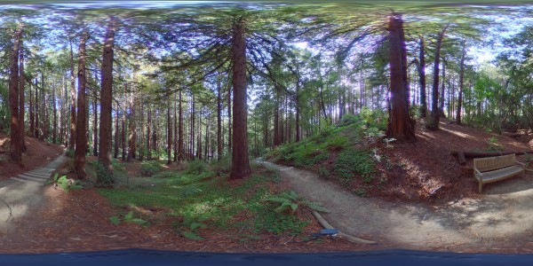
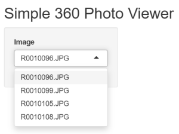
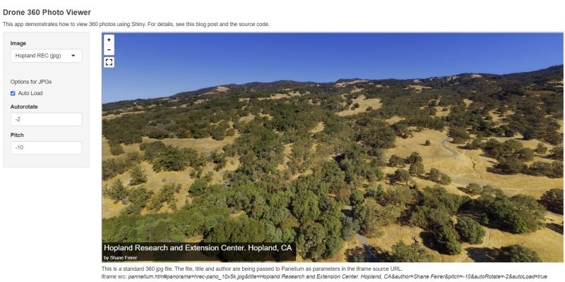

```{css echo = FALSE}
h1.title {font-weight:bold;}
h1 {font-size:30px; font-weight:bold;}
h2 {font-size:24px; font-weight:bold;}
h3 {font-size:18px; font-weight:bold;}
h4.date {font-size:90%;}
```

<p style="font-style:italic; font-size:90%; margin:2em;">IGIS <a href="http://igis.ucanr.edu/Tech_Notes/">Tech Notes</a> describe workflows and techniques or using geospatial science and technologies in research and extension. They are works in progress, and we welcome feedback and comments.</p>

# Introduction

360 photos are lot of fun to use and easy to make thanks to phone apps and affordable 360 cameras. Viewing them however requires special software. The images themselves are typically saved as JPGs with a 2:1 aspect ratio. They look distorted when viewed with a standard image viewer, but become interactive when rendered by 360 viewers.

  
*360 photos are saved as regular JPGs. Special viewers are required to make them interactive.*

# A 360 Shiny Viewer

Most 360 camera manufacturers bundle apps you can use to view your 360s on mobile devices. Social media platforms like FaceBook can also render them interactively, and that's how a lot of people share them. However these options can be limited and are klunky to use when you have dozens of 360 images, or want to do something a little out-of-the-box like overlay titles or set a default viewing angle.

This is where Shiny comes to the rescue. This post will show you how to create a simple Shiny app to view 360 images. You can run the app from RStudio on your laptop, or publish it on a Shiny server in the cloud (like (ShinyApps.io)[shinyapps.io/]). For best performance, the images themselves should be saved in the same place as the app (i.e., on your computer or the cloud).

## Pannellum

In this example, Shiny is really only being used as glorified HTML server. The real star of the show is [**Pannellum**](https://pannellum.org/). Pannellum is an awesome JavaScript library by [Matthew Petroff](https://mpetroff.net/) that renders 360 images in a browser. It's extremely easy to use out of the box, and has an impressive array of customizations for those who need enhanced functionality. For example you can overlay a title on the image, have it auto-rotate, control the field of view and zoom levels, etc. Even add clickable hotspots!

Below we'll first work through a basic case of using Shiny and Panellum to view a folder of 360 jpgs. After that we'll construct a more advanced Shiny app that takes advantages of some of Panellum's more advanced options. To see the final product, you can jump to the [Basic 360 Photo Viewer](https://ucanr-igis.shinyapps.io/ucb_botanical_garden/) featuring images from the UC Berkeley Botanical Garden, or the [Intermediate 360 Viewer](https://ucanr-igis.shinyapps.io/aerial360s/) showing a few aerial 360 photos taken from a drone. You can also download the source code and sample images for both apps from [here](https://github.com/ucanr-igis/360viewer).

This tutorial presume you already know the basics of Shiny (at least enough to follow the code). If not, check out some of the great [getting started with Shiny tutorials](https://shiny.rstudio.com/tutorial/) from RStudio. 

# Part I. Basic Viewer

## Set up the directory and support files

To create the basic viewer, first create a directory for your app. In this example we'll call it `my360s`. Within that folder make an empty folder called `www`. This is where we'll put the images and other assets needed for the viewer. Your directory structure should look like:

<pre>
/.../my360s
       └──www/
</pre>

Next download the [Panellum files](https://pannellum.org/download/). From the zip file you download, copy the following three files to the `www` folder:

<pre>
/.../my360s
       └──www/
            ├──pannellum.htm
            ├──pannellum.js
            └──pannellum.css
</pre>

Next, throw some 360 jpgs into `www`. If you don't have any of your own, you can use [these](https://drive.google.com/file/d/1r4_EmWCT1xkq5MRUa2m-1GWTeQ2H4IMR/view?usp=sharing).

<pre>
/.../my360s
       └──www/
            ├──pannellum.htm
            ├──pannellum.js
            ├──pannellum.css
            ├──R0010096.JPG
            ├──R0010099.JPG
            ├──R0010105.JPG
            └──R0010108.JPG
</pre>

## Create app.R

Now we're ready to create the code for the Shiny app. In RStudio, select File >> New File >> Shiny Web App. Create a single-file web app (app.R) and put it **parent directory** of `www`:

<pre>
/.../my360s
       ├──app.R
       └──www/
            ├──pannellum.htm
            ├──pannellum.js
            ├──pannellum.css
            ├──R0010096.JPG
            ├──R0010099.JPG
            ├──R0010105.JPG
            └──R0010108.JPG
</pre>

We'll build out app.R in two steps. In the first pass, we will:

1. Create a vector of the JPG filenames  
2. Set up the UI with a) a select input (drop down box) for the JPG files, and b) a uiOuptput object which will become our iFrame.

Here's the code for the first version of app.R. You should be able to copy-paste it into RStudio. After you paste it, save it then click the 'Run app' button to make sure it works.

```{r eval = FALSE}
library(shiny)

## Create a vector of the JPG files in the 'www' directory.
## We do this *outside* of ui() and server() because this only needs to be done once and only once
imgs_fn <- list.files("www", pattern = "JPG$|JPEG$", ignore.case = TRUE)

## Define the UI
ui <- fluidPage(
  titlePanel("Simple 360 Photo Viewer"),
  
  sidebarLayout(
    sidebarPanel(
      selectInput("img_fn", "Image", choices = imgs_fn, selected = NULL),
      width = 2
    ),
    mainPanel(
      uiOutput("pano_iframe")
    )
  )
)

server <- function(input, output) {

}

# Run the application 
shinyApp(ui = ui, server = server)

```

At this point, if everything is working when you click the 'Run App' button a RStudio viewer or web browser should open and you will see this:




Next, we'll build the `server()` function. Replace the blank `server` function above with the code below. When all is said-and-done your app.R should look like [this](https://gist.github.com/ajlyons/58233833b4b5ccde08fd47810802f6f5). 

The server function updates controls in the user interface. In our case, there's only one form control we need to update dynamically - the iframe. We do this with a `renderUI()` function that returns a HTML tag for an iFrame.

```{r eval = FALSE}
server <- function(input, output) {

  output$pano_iframe <- renderUI({

    ## Construct the iframe URL
    src_url <- paste0("pannellum.htm#panorama=",
                                input$img_fn, 
                                "&autoLoad=true&autoRotate=-2")
    
    tags$iframe(src = URLencode(src_url), width = "1200px", height = "600px")
  })
}

```

The key attribute of the iframe is source URL. Here is an example of a Pannellum URL:

```
pannellum.htm#panorama=R0010096.JPG&autoLoad=true&autoRotate=-2
```

Essentially, the URL is `pannellum.htm`, plus some parameters that specify which JPG image to display, and options like whether or not to autoLoad the image, and how fast to autoRotate (in degrees per second). 
For more details and to see what other parameters you can add, read the [Panellum documentation](https://pannellum.org/documentation/overview/). We'll see examples of some additional parameters in Part II below.

You may be wondering why the iframe URL doesn't include the `www` subdirectory? With Shiny, once the web app is running the `www` folder acts as the base or root. Hence the URL which populates the iframe doesn't require a path for either pannellum.htm or the images. If the images were in a subdirectory of `www`, we would certainly need to include that in the URL.

Click Run App again and if everything is good you should have a fully functioning basic 360 viewer. To view more images, all you need to do is move them into `www`. You can also copy directories of images into `www` and add `recursive = TRUE` to `list.files()` that creates `imgs_fn`.

# Part II. Drone 360 Photo Viewer

In the next example we'll create a more advanced 360 viewer, taking advantage of additional parameters you can pass the Pannellum URL. Specifically, we'll overlay the title, name of the author, and pitch (i.e., downward camera angle). The later will be useful because this example uses 360 images taken from drones. To see the final product, click on the image below:

<a href="https://ucanr-igis.shinyapps.io/aerial360s/" target="_blank"></a>

\

To run the Drone 360 Viewer on your own machine, download the [repo](https://github.com/UCANR-IGIS/360viewer){target="_blank" rel="noopener"}, unzip it, and open  `aerial360s/app.R` in RStudio. The directory structure for this app is very similar to the basic viewer in Part I, with a couple of additions:

- `images.csv`. Instead of reading the JPGs with `list.files()`, we have them listed in a csv file along with the name of the author, a short title for the select input, and a long title to overlay.

- The `www` folder has several 360 JPGs (like Part I). However in addition, one of our 360s has been converted to '**tiles**' that live in their own sudirectory (`elkus`). Converting a 360 jpg into tiles helps the browser render the 360 at maximum resolution without any lag time. (More on tiles below).

Here is `app.R`:

```{r eval = FALSE}
library(shiny)

## Read in a csv file which contains the JPG file names, image titles, etc.
imgs_df <- read.csv("images.csv", stringsAsFactors = FALSE)

## Error checks
if (anyDuplicated(imgs_df$title_short)) stop("The 'title_short' column must contain unique values")
if (FALSE %in% file.exists(file.path("www", imgs_df$fn))) stop("Missing file(s)")

## Define the UI
ui <- fluidPage(
  titlePanel("Drone 360 Photo Viewer"),
  
  sidebarLayout(
    sidebarPanel(
      selectInput("img_title_short", "Image", choices = imgs_df$title_short, selected = NULL),
      br(),
      p("Options for JPGs"),
      checkboxInput("autoload", "Auto Load", value = TRUE),
      numericInput("autorotate", "Autorotate", -2),
      numericInput("pitch", "Pitch", -10),
      width = 2
    ),
    
    mainPanel(
      uiOutput("pano_iframe")
    )
  )
)

server <- function(input, output) {
  ## Render the iFrame 
  output$pano_iframe <- renderUI({

    ## Get the row number of the selected image
    idx <- which(imgs_df$title_short == input$img_title_short)
    
    if (grepl(".json$", imgs_df$fn[idx], ignore.case = TRUE)) {
      
      ## This is a JSON file, so no need to append anything else to the URL
      src_url <- paste0("pannellum.htm?config=", imgs_df$fn[idx])

    } else {
      
      ## Construct the URL parts
      title_param <- ifelse(is.na(imgs_df$title_long[idx]), "", 
                            paste0("&title=", imgs_df$title_long[idx]))
      
      author_param <- ifelse(is.na(imgs_df$author[idx]), "", 
                            paste0("&author=", imgs_df$author[idx]))
      
      autorotate_param <- paste0("&autoRotate=", input$autorotate)
      
      autoload_param <- ifelse(input$autoload, "&autoLoad=true", "&autoLoad=false")
      
      pitch_param <- paste0("&pitch=", input$pitch)
      
      src_url <- paste0("pannellum.htm#panorama=", imgs_df$fn[idx], 
                        title_param, author_param, 
                        pitch_param, autorotate_param, autoload_param)
      
    }
    
    ## Return an iFrame tag which will become the new content of pano_iframe
    tags$iframe(src = URLencode(src_url), width = "1200px", height = "600px")
  })

}

# Run the application 
shinyApp(ui = ui, server = server)

```

The app.R for the Aerial 360 Viewer is similar to the basic viewer, however instead of reading the JPG files with `list.files()` they're read in from a csv file which has additional columns. These additional columns become parameters in the iframe source URL. In addition, some of the display parameter in the URL are programaticly linked to form controls in the UI.

# Tiled 360 Images

High resolution 360 images can be quite large (> 100 MB is not uncommon). This can increase the amount of time it takes for the image to load, because rendering is done on the client thus can not start until the entire image is downloaded. Large images can also cause lags and staggering in the browser. 

To cope with this, Pannellum supports multi-resolution image tiles. Tiles are a tried-and-true technique for handling large raster files. You can convert a large 360 JPG into a folder of tiles using Python and Hugin ([details](https://pannellum.org/documentation/examples/multiresolution/)), but the benefit is only really noticeable with large JPGs (i.e., greater than 10000 x 5000 pixels).

To display a tiled image with Pannellum, you need to also create a json file [[example](https://github.com/UCANR-IGIS/360viewer/blob/master/aerial360s/www/elkus/elkus.json)] that has all the parameters for displaying the image. This includes the parameters we previously passed in the URL, such as the title, author, auto rotate speed, etc. But it also include additional parameters related specifically to tiles, such as the path, tile resolution, max level, etc. JSON files also allow you to create clickable hotspots and all kinds of other cool stuff. For details on creating json files, see the [Pannellum documentation](https://pannellum.org/documentation/reference/#json-configuration-file-options). You can also create JSON files to display regular 360 jpgs ([example](https://github.com/UCANR-IGIS/360viewer/blob/master/aerial360s/www/krec.json)).

To display a tiled 360 image, all you have to do is pass the json file as the `config` parameter in the URL, like this:

```
pannellum.htm?config=elkus/elkus.json 
```

Note in this case we include a subdirectory with `elkus.json`, because it lives in a subdirectory of `www`.

# Conclusion

Shiny + Pannellum is a powerful combo for displaying 360 photos. If you have folders and folders of 360 photos that haven't seen the light of day since you took them, create a Shiny app to preview them locally then upload the best-of-the-best to a deployed Shiny app to share with friends and family.
